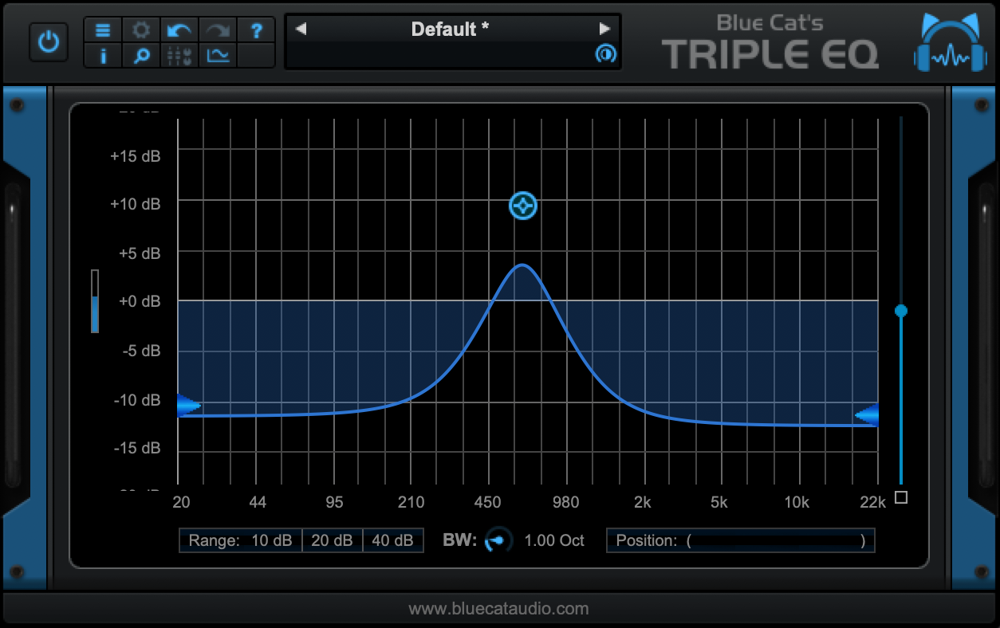
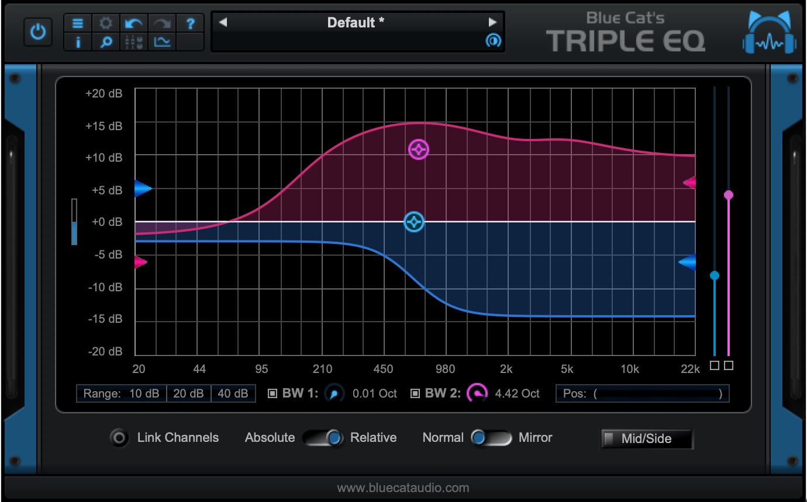

# Blue Cat's Tripple EQ

---

[Home](../) > [Effects](./)

---

## Mono and Stereo Version

|      | Rotary 1 | Rotary 2  | Rotary 3  | Rotary 4 | Rotary 5 | Rotary 6 |
|------|----------|-----------|-----------|----------|----------|----------|
|      | Gain     | Frequency | Bandwidth | Low      | Mid      | High     | 
| Push | Bypass   |           |           |          |          |          |

## Dual Version

|          | Rotary 1 | Rotary 2    | Rotary 3    | Rotary 4 | Rotary 5 | Rotary 6 |
|----------|----------|-------------|-------------|----------|----------|----------|
|          | Gain     | Frequency   | Bandwidth   | Low      | Mid      | High     | 
| Option + | Gain 2   | Frequency 2 | Bandwidth 2 | Low 2    | Mid 2    | High 2   | 
| Push     | Bypass   |             |             |          |          |          |

---