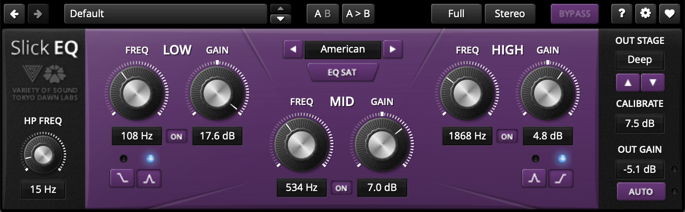

# SlickEQ

---

[Home](../) > [Effects](./)

---

|         | Rotary 1 | Rotary 2   | Rotary 3   | Rotary 4    | Rotary 5      | Rotary 8      |
|---------|----------|------------|------------|-------------|---------------|---------------|
|         | HP Freq  | Low Freq   | Mid Freq   | High Freq   | EQ Model      | Gain Out      |
| Option  |          |            |            |             |               | Drive Out     |
| Push    |          | Low Shape  |            | High Shape  | EQ Saturation | Bypass        |
| Opt+Psh |          | Low Bypass | Mid Bypass | High Bypass |               | Auto Gain     |
|         |  |  |  | |  |  |
|         |  | ***Fader 2***    | ***Fader 3***    | ***Fader 4***     |  |  |
|         |  | Low Gain   | Mid Gain   | High Gain   |  | |

---
