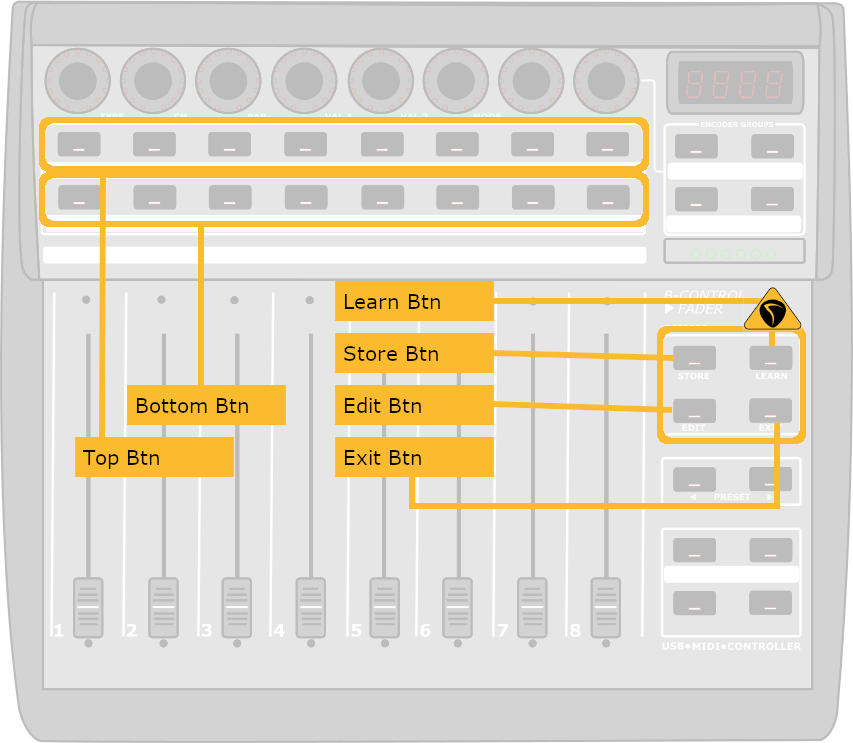

# Effects

---

[Home](../)

---

| Button | Action |
|--------|--------|
| Top Btns | ByPass the effect |
| Bottom Btns | Open effect window and go to corresponding zone |

## Currently supported effects and instruments:

### Effects

#### ReaPlugs [(ReaPlugs Website)][reaplugs]

* [ReaComp](./ReaComp.md)
* [ReaEQ](./ReaEQ.md)

#### Blue Cat [(Blue Cat Website)][bluecat]

* [Blue Cat Chorus](./BlueCatChorus.md)
* [Blue Cat Flanger](./BlueCatFlanger.md)
* [Blue Cat Free Amp](./BlueCatFreeAmp.md)
* [Blue Cat Freq Analyst](./BlueCatFreqAnalyst.md)
* [Blue Cat Gain](./BlueCatGain.md)
* [Blue Cat Phaser](./BlueCatPhaser.md)
* [Blue Cat Tripple EQ](./BlueCatTrippleEQ.md)

#### Melda Productions [(Melda Website)][melda]

* [MAutopan](./MAutopan.md)
* [MCompressor](./MCompressor.md)
* [MBandPass](./MBandPass.md)

#### Analog Obsession [(Analog Obsession Website)][analogObsession]

* [LALA](./AnalogObsessionLala.md)
* [TREANSATURE](./AnalogObsessionTransature.md)

### Others:

* [TDR Slick EQ](./SlickEQ.md) - [(Tokyo Dawn Labs Website)][tdr]
* [Molot](./Molot.md) - [(Molot on the Tokyo Dawn Labs Website)][tdr]
* [ValhallaFreqEcho](./ValhallaFreqEcho.md) - [(Valhalla's Website)][valhalla]
* [Waves CLA-76](./WavesCla76.md) - [(Waves Website)][waves]

### Instruments

* [CollabB3](./CollaB3.md) - [(CollabB3 Website)][CollabB3]

---

[reaplugs]: http://reaper.fm/reaplugs/
[bluecat]: https://www.bluecataudio.com/Products/Bundle_FreewarePack/
[melda]: https://www.meldaproduction.com/MFreeFXBundle
[tdr]: https://www.tokyodawn.net/tokyo-dawn-labs/
[valhalla]: https://valhalladsp.com/
[waves]: https://www.waves.com/
[CollabB3]: https://sampleson.com/collab3-free-tonewheel-organ.html
[analogObsession]: https://www.patreon.com/analogobsession
