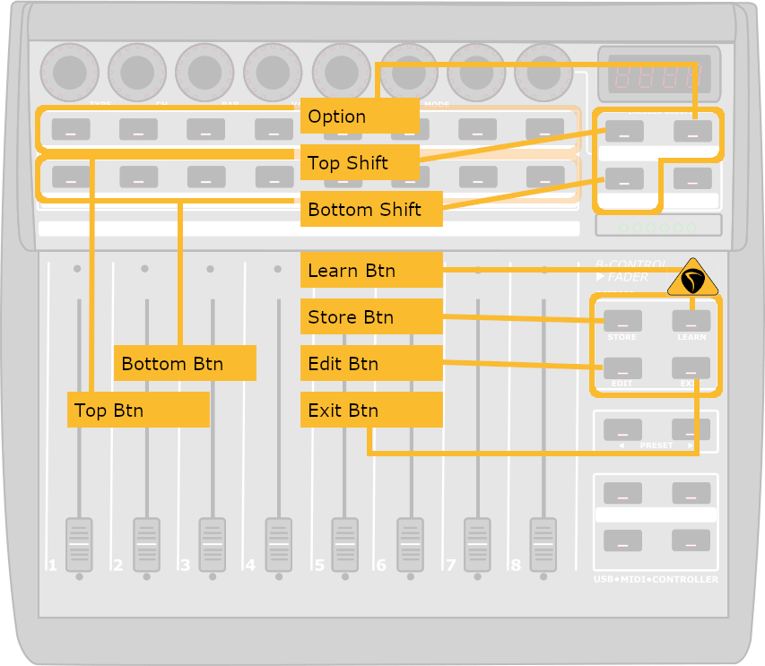

# Transport

---

[Home](../) > [Zones](./)

---

| Top Shift | Btm Shift | Hold   | Button | Action |
|:---------:|:---------:|:------:|--------|--------|
|           |           |        | Store Btn | Add marker at current position |
|           |           | X      | Store Btn | Edit current marker |
|           | X         |        | Store Btn | Remove closest marker |
|           |           |        | Learn Btn | Toggle Pre-fader track metering |
|           |           | X      | Learn Btn | No Action  |
| X         |           |        | Learn Btn | No Action  |
|           | X         |        | Learn Btn | No Action  |
|           |           |        | Edit Btn | Save the project |
| X         |           |        | Edit Btn | Undo Step |
|           | X         |        | Edit Btn | Redo undone step |
|           |           |        | Exit Btn | Unsolo All Tracks |
| X         |           |        | Exit Btn | No Action  |
|           | X         |        | Exit Btn | No Action |
|           | X         |        | Top Btn 1 | Show Drum tracks |
|           | X         |        | Top Btn 2 | Show Bass tracks |
|           | X         |        | Top Btn 3 | Show Guitar Tracks |
|           | X         |        | Top Btn 4 | Show Vocal tracks |
|           | X         |        | Top Btn 5 | Show Key Tracks |
|           | X         |        | Bottom Btn 6 | Show Effect Tracks |
|           | X         |        | Bottom Btn 7 | Show Busses |
|           | X         |        | Bottom Btn 8 | Show All tracks |

> ### Note
>
> The top and bottom buttons are custom actions and are created to the way I work with Reaper.
> They function like demonstrated in this [ReperBlog Video](https://reaperblog.net/2015/11/video-follow-track-visibility-with-the-bcf2000/)
> The actual action files are added in this project, but you can easily assign other actions to these buttons.
> 
> More information about zone files and assinging actions can be found at the [CSI wiki](https://github.com/malcolmgroves/reaper_csi/wiki/Zones)

---