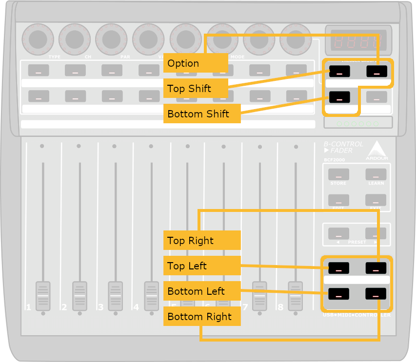
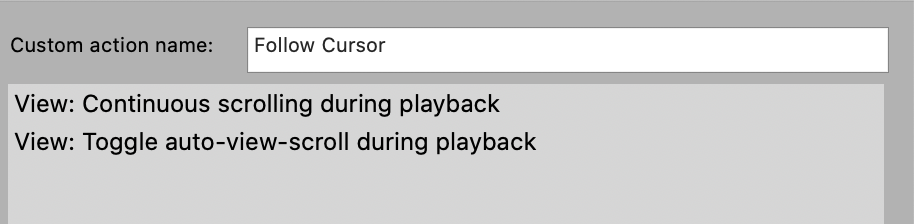

# Transport

---

[Home](../) > [Zones](./)

---

| Top Shift | Btm Shift | Hold   | Button | Action |
|:---------:|:---------:|:------:|--------|--------|
|           |           |        | Top Left | Go to previous Marker |
|           |           | X      | Top Left | Go to Project Start  |
| X         |           |        | Top Left | Scroll step Backward  |
|           | X         |        | Top Left | Go to Project Start  |
|           |           |        | Top Right | Go to next Marker |
|           |           | X      | Top Right | Go to Project End  |
| X         |           |        | Top Right | Scroll step Forward  |
|           | X         |        | Top Right | Go to Project End  |
|           |           |        | Bottom Left | Stop |
| X         |           |        | Bottom Left | Toggle Cycle / Repeat  |
|           | X         |        | Bottom Left | Toggle Metronome  |
|           | X         | X      | Bottom Left | Open Metronome Settings  |
|           |           |        | Bottom Right | Play / Pause |
| X         |           |        | Bottom Right | Record  |
|           | X         |        | Bottom Right | Toggle Follow Cursor (custom action) |

> ### Note
>
> The Toggle Follow Cursor is a custom action and looks like:
> 
> This action toggles the cursor following the song or not. You can also assing other actions to the button.
> 
>  * More information about zone files and assinging actions can be found at the [CSI wiki](https://github.com/malcolmgroves/reaper_csi/wiki/Zones)
>  * More information about creating Custom Actions can be found in this [video by Kenny Gioia](http://reaper.fm/videos.php#15Evzb7rWCo)

---